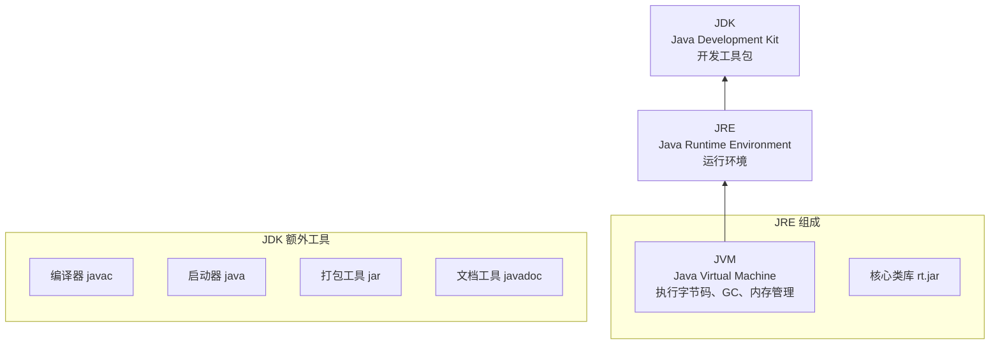
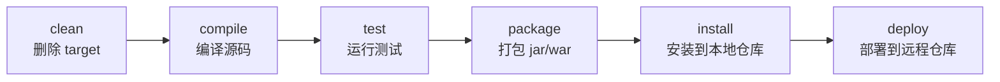

# Module 00：环境搭建与第一个程序

## 本课目标

- 理解 JDK / JRE / JVM 的关系
- 安装 JDK 并验证环境
- 用命令行编译和运行 Java 程序
- 安装 IntelliJ IDEA 并创建第一个项目
- 理解 Maven 项目的基本结构
- 编写并运行第一个 Java 程序

---

## 1. Java 体系基础

### 1.1 什么是 Java？

Java 是一种**编译 + 解释**执行的编程语言。源代码先被编译成**字节码（bytecode）**，然后在 JVM（Java Virtual Machine）上解释执行。

**核心优势**：一次编写，到处运行（Write Once, Run Anywhere）——同一份 `.class` 文件可在 Windows、Linux、macOS 上运行，前提是目标平台有对应的 JVM。

### 1.2 JDK / JRE / JVM 的关系



- **JVM**：执行字节码，提供跨平台能力
- **JRE** = JVM + 核心类库，只能**运行** Java 程序
- **JDK** = JRE + 开发工具（编译器、调试器等），能**开发** Java 程序

> 开发时必须装 JDK，只运行程序时可用 JRE。

---

## 2. 安装与验证 JDK

### 2.1 选择版本

推荐 **JDK 21 LTS** 或更高版本。本课程基于 JDK 21+ 编写，当前环境运行的是 **JDK 25**，完全兼容。

常见发行版（选一个即可）：

| 发行版 | 特点 |
|---|---|
| [Adoptium Eclipse Temurin](https://adoptium.net/) | Eclipse 社区维护，免费，推荐 |
| [Amazon Corretto](https://aws.amazon.com/corretto/) | AWS 维护，免费 |
| [Oracle JDK](https://www.oracle.com/java/technologies/downloads/) | 官方版，商用需付费 |
| [Azul Zulu](https://www.azul.com/downloads/) | 免费，支持平台多 |

### 2.2 验证安装

打开命令行（cmd / PowerShell / Git Bash），运行：

```bash
java -version
```

输出示例：

```
java version "25.0.1" 2025-10-21 LTS
Java(TM) SE Runtime Environment (build 25.0.1+8-LTS-27)
Java HotSpot(TM) 64-Bit Server VM (build 25.0.1+8-LTS-27, mixed mode, sharing)
```

```bash
javac -version
# javac 25.0.1
```

> **没有找到 java 命令？**
>
> 1. 从 Adoptium 下载并安装 JDK
> 2. 设置环境变量 `JAVA_HOME` 指向 JDK 安装目录
> 3. 将 `%JAVA_HOME%\bin` 添加到 `PATH`
> 4. 重启命令行窗口

---

## 3. 第一个程序：命令行方式

先不依赖 IDE，用最原始的方式体验 Java 的编译和运行流程。

### 3.1 编写源代码

创建文件 `HelloWorld.java`：

```java
/**
 * 第一个 Java 程序
 * 文件名必须和 public class 的类名一致
 */
public class HelloWorld {

    // main 方法是程序的入口
    public static void main(String[] args) {
        System.out.println("Hello, World!");
    }
}
```

### 3.2 编译

```bash
javac HelloWorld.java
```

执行后生成 `HelloWorld.class`（字节码文件）。用文本编辑器打开它——全是乱码，因为这是给 JVM 执行的，不是给人读的。

### 3.3 运行

```bash
java HelloWorld    # 注意：不加 .class 后缀
# 输出：Hello, World!
```

### 3.4 完整流程总结


**三个关键理解**：
1. `.java` 文件是**源代码**，你编写代码时编辑它
2. `.class` 文件是**编译产物**，JVM 执行它
3. 修改代码后必须**重新编译**才能看到变化

---

## 4. 使用 IntelliJ IDEA

### 4.1 下载安装

从 [JetBrains 官网](https://www.jetbrains.com/idea/download/) 下载 **Community Edition**（免费开源版，够用）。

### 4.2 创建第一个项目

1. 打开 IDEA → **New Project**
2. 配置如下：

| 字段 | 值 |
|---|---|
| Name | `JavaLearn` |
| Location | `E:\Claude Code\JavaLearn` |
| Language | `Java` |
| Build System | `IntelliJ`（先选这个熟悉 IDEA，后续改 Maven） |
| JDK | 选择已安装的 JDK |
| Template | `Class with main()` |

3. 点击 **Create**

### 4.3 IDEA 界面速览

```
┌─────────────────────────────────────────────────┐
│ 菜单栏  File  Edit  View  Navigate  Code  ...  │
├──────────────────┬──────────────────────────────┤
│  Project 面板    │         编辑区               │
│  (文件树)        │    (写代码的地方)             │
│                  │                              │
│  src/            │  public class Main {         │
│    Main.java     │      public static void      │
│                  │          main(String[] args){│
│                  │          System.out.println( │
│                  │            "Hello");         │
│                  │      }                       │
│                  │  }                           │
├──────────────────┴──────────────────────────────┤
│              控制台 / Terminal                   │
│           (运行输出 / 错误信息)                   │
└─────────────────────────────────────────────────┘
```

### 4.4 运行程序

- 点击类名旁边的绿色 ▶ 按钮
- 或右键 → **Run `Main.main()`**
- 或按 `Ctrl + Shift + F10`

### 4.5 常用快捷键

| 操作 | Windows 快捷键 |
|---|---|
| 运行当前文件 | `Ctrl + Shift + F10` |
| 格式化代码 | `Ctrl + Alt + L` |
| 万能提示（建议/修复） | `Alt + Enter` |
| 查找类 | `Ctrl + N` |
| 代码补全 | `Ctrl + Space` |

---

## 5. Maven 项目结构

实际项目几乎都使用 **Maven** 或 **Gradle** 管理依赖和构建。Maven 是 Java 世界最流行的构建工具。

### 5.1 目录结构

```
my-project/
├── pom.xml                    ← Maven 配置文件（核心）
├── src/
│   ├── main/
│   │   └── java/              ← 源代码
│   │       └── com/example/
│   │           └── App.java
│   └── test/
│       └── java/              ← 测试代码
│           └── com/example/
│               └── AppTest.java
```

### 5.2 pom.xml 核心概念

```xml
<?xml version="1.0" encoding="UTF-8"?>
<project xmlns="http://maven.apache.org/POM/4.0.0"
         xmlns:xsi="http://www.w3.org/2001/XMLSchema-instance"
         xsi:schemaLocation="http://maven.apache.org/POM/4.0.0
         http://maven.apache.org/xsd/maven-4.0.0.xsd">

    <modelVersion>4.0.0</modelVersion>

    <!-- 坐标：全局唯一标识 -->
    <groupId>com.example</groupId>          <!-- 组织名（域名倒写） -->
    <artifactId>hello-world</artifactId>    <!-- 项目名 -->
    <version>1.0-SNAPSHOT</version>         <!-- 版本号 -->

    <properties>
        <maven.compiler.source>21</maven.compiler.source>
        <maven.compiler.target>21</maven.compiler.target>
        <project.build.sourceEncoding>UTF-8</project.build.sourceEncoding>
    </properties>

    <dependencies>
        <!-- 第三方依赖写在这里 -->
    </dependencies>
</project>
```

**坐标三要素**：`groupId` + `artifactId` + `version` 唯一确定一个项目。

### 5.3 Maven 生命周期



### 5.4 Maven 常用命令

```bash
mvn clean          # 删除 target/
mvn compile        # 编译到 target/classes
mvn test           # 运行测试
mvn package        # 打包 jar/war
mvn clean compile  # 可以组合使用
```

---

## 6. 实战：运行我们的项目

### 6.1 项目结构

```
hello-world/
├── pom.xml
└── src/
    ├── main/java/com/example/App.java
    └── test/java/com/example/AppTest.java
```

### 6.2 代码

`src/main/java/com/example/App.java`：

```java
package com.example;

public class App {
    public static void main(String[] args) {
        System.out.println("Hello, World!");
        System.out.println("JDK 版本: " + System.getProperty("java.version"));
    }
}
```

### 6.3 编译运行

**方式一：手动 javac + java**

```bash
# 编译
javac -d target/classes src/main/java/com/example/App.java

# 运行
java -cp target/classes com.example.App
```

**方式二：Maven**

```bash
mvn compile
java -cp target/classes com.example.App
```

### 6.4 运行结果

```
Hello, World!
JDK 版本: 25.0.1
```

---

## 本课总结

| 知识点 | 掌握程度 |
|---|---|
| JDK / JRE / JVM 的区别 | 能用自己的话解释 |
| 命令行编译运行 Java 程序 | 熟练使用 `javac` + `java` |
| IDEA 基本操作 | 能创建项目、运行程序 |
| Maven 项目结构 | 理解 `pom.xml` 和目录布局 |
| 第一个 Java 程序 | **能不看教程写出来** |

## 课后练习

1. 修改 App.java，让程序输出你的名字和今天日期
2. 故意在代码中写一个语法错误（比如少一个分号），观察 javac 报什么错
3. 在 IDEA 中打开这个项目，用 IDEA 的 run 按钮运行（而不是命令行）

---

## 下节预告

Module 01：Java 语言基础——变量、数据类型、运算符、流程控制。
