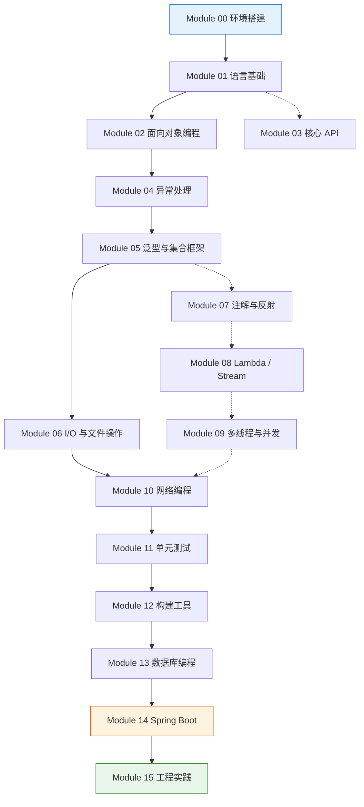
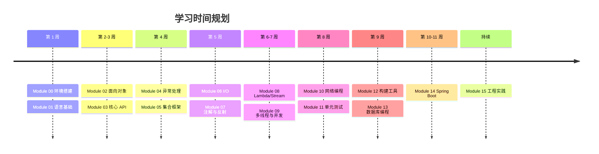

# Java 系统学习大纲

这是一份从零基础到工程实战的 Java 学习路线图。按**模块**组织，每个模块包含学习目标、知识点清单、练习项目和预计时间。

---

## 目录

- [Module 00：环境搭建与第一个程序](#module-00环境搭建与第一个程序)
- [Module 01：Java 语言基础](#module-01java-语言基础)
- [Module 02：面向对象编程](#module-02面向对象编程)
- [Module 03：常用核心 API](#module-03常用核心-api)
- [Module 04：异常处理](#module-04异常处理)
- [Module 05：泛型与集合框架](#module-05泛型与集合框架)
- [Module 06：I/O 与文件操作](#module-06io-与文件操作)
- [Module 07：注解与反射](#module-07注解与反射)
- [Module 08：Lambda 与 Stream API](#module-08lambda-与-stream-api)
- [Module 09：多线程与并发](#module-09多线程与并发)
- [Module 10：网络编程](#module-10网络编程)
- [Module 11：单元测试](#module-11单元测试)
- [Module 12：构建工具与项目结构](#module-12构建工具与项目结构)
- [Module 13：数据库编程](#module-13数据库编程)
- [Module 14：Spring Boot 入门](#module-14spring-boot-入门)
- [Module 15：工程实践与进阶](#module-15工程实践与进阶)
- [附录：学习资源汇总](#附录学习资源汇总)

---

## Module 00：环境搭建与第一个程序

**预计时间**：1 天

| 项目 | 内容 |
|---|---|
| 学习目标 | 搭建开发环境，运行第一个 Java 程序 |
| 推荐 JDK | OpenJDK 21 LTS（或 17 LTS） |
| IDE | IntelliJ IDEA Community Edition |
| 构建工具 | Maven（或 Gradle） |

### 知识点

1. JDK / JRE / JVM 的区别
2. 下载安装 JDK，配置 `JAVA_HOME` 与 `PATH`
3. 用命令行编译运行：`javac` → `java`
4. IntelliJ IDEA 的基本使用：创建项目、运行、调试
5. Maven 项目结构：`pom.xml`、`src/main/java`、`src/test/java`
6. 第一个程序：HelloWorld

### 练习

1. 用命令行和 IDE 分别运行 HelloWorld
2. 创建 Maven 项目，理解 `pom.xml` 的基本元素
3. 练习 Debug 模式：打断点、单步执行、查看变量

### 参考文件

- `tutorial/Module00-HelloWorld/`

---

## Module 01：Java 语言基础

**预计时间**：1 周

### 知识点

1. **变量与数据类型**
   - 基本类型：`byte`、`short`、`int`、`long`、`float`、`double`、`char`、`boolean`
   - 引用类型、自动装箱与拆箱
   - `var` 关键字（JDK 10+）
   - 常量 `final`

2. **运算符**
   - 算术、赋值、比较、逻辑、位运算
   - 运算符优先级

3. **流程控制**
   - `if-else`、`switch`（含 JDK 14+ arrow 语法）
   - `for`（普通 / 增强 for-each）、`while`、`do-while`
   - `break`、`continue`、`return`

4. **数组**
   - 一维数组、二维数组
   - `Arrays` 工具类

5. **字符串**
   - `String` 不可变性、字符串常量池
   - `StringBuilder` / `StringBuffer`
   - 字符串常用方法：`substring`、`split`、`join`、`format`

### 练习

1. 打印九九乘法表
2. 实现猜数字游戏
3. 统计字符串中每个字符的出现次数

### 参考文件

- `tutorial/Module01-Basics/`

---

## Module 02：面向对象编程

**预计时间**：1.5 周

### 知识点

1. **类与对象**
   - 构造方法、`this` 关键字
   - 字段、方法、局部变量
   - 方法重载（Overload）

2. **封装**
   - 访问修饰符：`private`、`default`、`protected`、`public`
   - Getter / Setter

3. **继承**
   - `extends`、`super`
   - 方法重写（Override）与 `@Override`
   - 构造方法链
   - `final` 类与方法

4. **多态**
   - 向上转型、向下转型
   - `instanceof` 与 Pattern Matching（JDK 16+）

5. **抽象类与接口**
   - `abstract` 类与方法
   - `interface`：默认方法、静态方法、私有方法（JDK 9+）
   - 接口与抽象类的选择

6. **高级特性**
   - `record`（JDK 16+）
   - `sealed class`（JDK 17+）
   - `enum`：字段、方法、`switch` 配合使用
   - 内部类、匿名类、静态嵌套类

7. **Object 类**
   - `equals()` 与 `hashCode()` 约定
   - `toString()`、`clone()`

### 练习

1. 设计一个 `Shape` 继承体系（`Circle`、`Rectangle`、`Triangle`），实现面积计算和多态
2. 用 `enum` 实现一个状态机
3. 实现 `equals` 和 `hashCode`，用于集合查找

### 参考文件

- `tutorial/Module02-OOP/`

---

## Module 03：常用核心 API

**预计时间**：3 天

### 知识点

1. **java.lang**
   - `Math`、`System`、`Runtime`
   - 包装类

2. **日期时间 API（java.time）**
   - `LocalDate`、`LocalTime`、`LocalDateTime`
   - `ZonedDateTime`、`Instant`、`Duration`、`Period`
   - `DateTimeFormatter`
   - 旧 API（`Date`、`Calendar`）了解即可

3. **Optional**
   - `of`、`ofNullable`、`orElse`、`orElseGet`、`orElseThrow`
   - `map`、`flatMap`、`filter`

### 练习

1. 实现一个"今天是星期几"的计算器
2. 用 `Optional` 重构一段可能 NPE 的代码

---

## Module 04：异常处理

**预计时间**：2 天

### 知识点

1. **异常体系**
   - `Throwable`：`Error` vs `Exception`
   - `Checked Exception` vs `RuntimeException`
   - 常见异常：`NullPointerException`、`IllegalArgumentException`、`IOException`

2. **异常处理机制**
   - `try-catch-finally`
   - `try-with-resources`（JDK 7+）
   - 多 `catch` 合并（JDK 7+）

3. **最佳实践**
   - 抛出 vs 捕获的选择
   - 自定义异常
   - 不要吞异常、不要用异常控制流程

### 练习

1. 实现一个银行账户类，转账时校验余额不足抛自定义异常
2. 用 `try-with-resources` 读取文件

---

## Module 05：泛型与集合框架

**预计时间**：1 周

### 知识点

1. **泛型**
   - 泛型类、泛型方法、泛型接口
   - 类型擦除
   - 通配符：`? extends T` / `? super T`（PECS 原则）
   - 泛型边界

2. **Collection 接口体系**
   - `List`：`ArrayList` vs `LinkedList`
   - `Set`：`HashSet`、`LinkedHashSet`、`TreeSet`
   - `Queue` / `Deque`：`ArrayDeque`、`PriorityQueue`

3. **Map**
   - `HashMap`：底层原理（数组 + 链表/红黑树）、扩容因子
   - `LinkedHashMap`：LRU 缓存应用
   - `TreeMap`：红黑树、排序
   - `ConcurrentHashMap` 初识

4. **Collections 工具类**
   - `sort`、`binarySearch`、`unmodifiable`、`singleton`

5. **不可变集合**
   - `List.of()`、`Set.of()`、`Map.of()`（JDK 9+）

### 练习

1. 手写一个简易的 `ArrayList`（加深对扩容机制的理解）
2. 用 `HashMap` 实现词频统计
3. 用 `PriorityQueue` 实现 Top K 问题

### 参考文件

- `tutorial/Module05-Collections/`

---

## Module 06：I/O 与文件操作

**预计时间**：3 天

### 知识点

1. **File API**
   - `java.io.File`：创建、删除、遍历目录
   - NIO 替代：`java.nio.file.Path`、`Files`、`Paths`

2. **字节流与字符流**
   - `InputStream` / `OutputStream` → `FileInputStream` / `FileOutputStream`
   - `Reader` / `Writer` → `FileReader` / `FileWriter`
   - `BufferedInputStream` / `BufferedReader`
   - 转换流：`InputStreamReader` / `OutputStreamWriter`

3. **NIO.2**
   - `Files.walk`、`Files.list` 遍历目录
   - `Files.readString` / `Files.writeString`（JDK 11+）

4. **序列化**
   - `Serializable` 接口、`serialVersionUID`
   - `transient` 关键字

### 练习

1. 实现文件复制（字节流 / NIO 两种方式）
2. 递归遍历目录树，统计每种文件类型的数量
3. 实现一个简单的配置文件解析器（properties 格式）

---

## Module 07：注解与反射

**预计时间**：3 天

### 知识点

1. **注解**
   - 元注解：`@Retention`、`@Target`、`@Inherited`、`@Documented`
   - 自定义注解
   - 编译期 vs 运行期注解

2. **反射**
   - `Class` 对象获取方式
   - 构造方法、字段、方法的反射操作
   - `setAccessible` 与模块系统限制
   - 动态代理：`Proxy` + `InvocationHandler`

### 练习

1. 实现一个 `@LogExecutionTime` 注解，打印方法执行耗时
2. 用反射实现一个简单的依赖注入容器

---

## Module 08：Lambda 与 Stream API

**预计时间**：4 天

### 知识点

1. **Lambda 表达式**
   - 函数式接口：`Predicate`、`Consumer`、`Function`、`Supplier`
   - 方法引用：`ClassName::method`
   - 变量捕获

2. **Stream API**
   - 创建 Stream：`collection.stream()`、`Stream.of`、`Files.lines`
   - 中间操作：`filter`、`map`、`flatMap`、`distinct`、`sorted`、`peek`
   - 终止操作：`collect`、`forEach`、`reduce`、`count`、`anyMatch`
   - `Collectors`：`toList`、`toMap`、`groupingBy`、`partitioningBy`
   - 并行流 `parallelStream`（了解适用场景）

### 练习

1. 用 Stream 处理员工列表：分组、筛选、聚合
2. 用 `groupingBy` + `mapping` 实现多级分组
3. 对比 for 循环和 Stream 的性能（基准测试）

### 参考文件

- `tutorial/Module08-Stream/`

---

## Module 09：多线程与并发

**预计时间**：1.5 周

### 知识点

1. **线程基础**
   - `Thread` vs `Runnable`
   - 线程生命周期（NEW → RUNNABLE → BLOCKED/WAITING → TERMINATED）
   - `Callable` / `Future` / `FutureTask`

2. **线程安全**
   - `synchronized`（对象锁、类锁）
   - `volatile`（可见性、禁止指令重排）
   - `final` 在并发中的语义

3. **Lock 框架**
   - `ReentrantLock`、`ReentrantReadWriteLock`
   - `Condition`（await / signal）

4. **协作机制**
   - `wait` / `notify` / `notifyAll`
   - `CountDownLatch`、`CyclicBarrier`、`Semaphore`
   - `Exchanger`、`Phaser`

5. **并发容器**
   - `ConcurrentHashMap`（JDK 7 分段锁 vs JDK 8 synchronized + CAS）
   - `CopyOnWriteArrayList`
   - `BlockingQueue`：`ArrayBlockingQueue`、`LinkedBlockingQueue`

6. **线程池**
   - `ThreadPoolExecutor`：核心参数、拒绝策略
   - `Executors` 工厂（谨慎使用）
   - `ForkJoinPool` / 工作窃取

7. **Virtual Threads**（JDK 21+）
   - 虚拟线程与平台线程的区别
   - 适用场景

### 练习

1. 实现生产者-消费者模式（`BlockingQueue`）
2. 模拟多线程抢票（`synchronized` / `Lock` 两种方式）
3. 用线程池优化一批耗时任务的执行

### 参考文件

- `tutorial/Module09-Concurrency/`

---

## Module 10：网络编程

**预计时间**：3 天

### 知识点

1. **Socket 编程**
   - `ServerSocket` / `Socket`
   - BIO 模型

2. **NIO**
   - `Channel`、`Buffer`、`Selector`
   - 非阻塞 I/O 模型

3. **HTTP 客户端**
   - `HttpURLConnection`
   - `HttpClient`（JDK 11+）：同步 / 异步 / WebSocket

### 练习

1. 实现一个简单的 Echo Server
2. 用 `HttpClient` 调用公开 API 并解析 JSON 响应

---

## Module 11：单元测试

**预计时间**：2 天

### 知识点

1. **JUnit 5**
   - `@Test`、`@BeforeEach`、`@AfterEach`、`@BeforeAll`、`@AfterAll`
   - 断言：`assertEquals`、`assertThrows`、`assertAll`
   - 参数化测试：`@CsvSource`、`@ValueSource`、`@MethodSource`

2. **Mockito**
   - Mock 与 Stub：`when`、`verify`
   - `@Mock`、`@InjectMocks`、`@Spy`

3. **测试覆盖率**
   - JaCoCo 插件配置与报告解读

### 练习

1. 为之前的练习代码编写单元测试，覆盖率达到 80%+
2. 用 Mockito 模拟外部依赖测试 Service 层

---

## Module 12：构建工具与项目结构

**预计时间**：2 天

### 知识点

1. **Maven 深度**
   - 坐标系统：`groupId`、`artifactId`、`version`
   - 依赖管理：`dependency`、`scope`、`exclusions`
   - 生命周期：`clean` → `compile` → `test` → `package` → `install` → `deploy`
   - 插件机制：`maven-compiler-plugin`、`maven-surefire-plugin`

2. **Gradle 入门**
   - Groovy / Kotlin DSL
   - 对比 Maven 的优缺点

3. **多模块项目**
   - parent POM / 聚合模块
   - 模块间依赖

### 练习

1. 创建多模块 Maven 项目：`common` + `service` + `web`
2. 配置 Maven Profile 区分开发 / 生产环境

---

## Module 13：数据库编程

**预计时间**：5 天

### 知识点

1. **JDBC**
   - `Connection`、`Statement`、`PreparedStatement`、`ResultSet`
   - 事务管理：`commit` / `rollback` / `savepoint`
   - 连接池：HikariCP 配置

2. **Flyway**
   - 数据库版本迁移
   - `V1__init.sql`、`V2__add_index.sql`

3. **ORM 基础（MyBatis）**
   - XML 映射 / 注解映射
   - `#{}` vs `${}`
   - 动态 SQL

4. **ORM 进阶（JPA / Hibernate）**
   - `@Entity`、`@Table`、`@Column`
   - 关联映射：`@OneToMany`、`@ManyToOne`
   - JPQL / Criteria API
   - N+1 问题与解决方案

### 练习

1. 用 JDBC 实现 CRUD + 事务转账
2. 用 MyBatis 重新实现并对比
3. 设计博客系统的数据库表，用 JPA 映射

---

## Module 14：Spring Boot 入门

**预计时间**：2 周

### 知识点

1. **Spring 核心**
   - IoC / DI：`@Component`、`@Autowired`、`@Bean`、`@Configuration`
   - 作用域：singleton、prototype、request、session
   - AOP：`@Aspect`、`@Before`、`@After`、`@Around`

2. **Spring Boot**
   - 自动配置原理（`@EnableAutoConfiguration`、`spring.factories`）
   - `application.yml`：多环境配置
   - 常用 Starter：`web`、`data-jpa`、`validation`

3. **Spring MVC（REST API）**
   - `@RestController`、`@RequestMapping`
   - 请求参数绑定：`@RequestParam`、`@PathVariable`、`@RequestBody`
   - 响应封装：统一返回结构
   - 全局异常处理：`@ControllerAdvice`
   - 参数校验：`@Valid` + `jakarta.validation`

4. **数据访问**
   - Spring Data JPA：`JpaRepository`、`@Query`、Specification
   - 事务：`@Transactional`（传播行为、隔离级别）

5. **安全**
   - Spring Security 基本认证
   - JWT Token 登录流程

6. **测试**
   - `@SpringBootTest`、`@WebMvcTest`、`@DataJpaTest`
   - `TestRestTemplate` / `WebTestClient`（WebFlux）
   - 嵌入式数据库（H2）测试

### 练习

1. 搭建 RESTful API：用户 CRUD
2. 实现 JWT 登录认证
3. 集成测试覆盖主要接口

### 参考文件

- `tutorial/Module14-SpringBoot/`

---

## Module 15：工程实践与进阶

**预计时间**：持续

### 知识点

1. **设计模式**
   - 创建型：单例（饿汉/懒汉/枚举）、工厂方法、抽象工厂、建造者
   - 结构型：适配器、装饰器、代理、外观
   - 行为型：策略、模板方法、观察者、责任链

2. **代码质量**
   - Checkstyle：代码风格检查
   - SpotBugs / ErrorProne：静态分析
   - SonarQube：综合质量门禁

3. **性能优化**
   - JVM 内存模型
   - GC 算法：G1GC、ZGC
   - 内存泄漏排查（MAT / JProfiler）
   - 性能基准测试（JMH）

4. **Docker 容器化**
   - 编写 Dockerfile：多阶段构建
   - docker-compose：App + DB + Redis

5. **CI/CD**
   - GitHub Actions：编译 → 测试 → 构建镜像 → 部署

6. **响应式编程（可选）**
   - Project Reactor：Mono / Flux
   - Spring WebFlux

### 练习

1. 用 3 种方式实现线程安全的单例模式
2. 将 Spring Boot 应用容器化
3. 配置 GitHub Actions 自动化流水线

---

## 学习路径图

---

## 学习建议

1. **动手 > 看书**：每个模块学完知识点，立刻完成练习
2. **先写烂代码，再写好代码**：初期不要追求完美，先跑通再优化
3. **善用官方文档**：遇到问题先查 [Java Doc](https://docs.oracle.com/en/java/javase/21/)、[Spring Doc](https://docs.spring.io/spring-boot/)
4. **读源码**：ArrayList、HashMap 的源码是最好的教科书
5. **持续输出**：把学到的东西写成博客或笔记

---

## 附录：学习资源汇总

### 书籍

| 书名 | 适合阶段 | 推荐理由 |
|---|---|---|
| 《Java 核心技术 卷 I》 | 1-6 | 基础最全面 |
| 《On Java 8》（原《Thinking in Java》） | 1-6 | 深入原理 |
| 《Effective Java 3rd》 | 5-8 | 进阶必读，每一条都是实战经验 |
| 《Java 并发编程实战》 | 9 | 并发圣经 |
| 《Spring 实战》 | 14 | Spring 入门经典 |

### 在线资源

- [Java Official Tutorial](https://docs.oracle.com/javase/tutorial/)
- [Baeldung](https://www.baeldung.com/) — Spring 与 Java 技术文章
- [Dev.java](https://dev.java/) — Oracle 官方 Java 学习平台

### 刷题平台（用 Java 练手）

- LeetCode — 数据结构和算法
- CodeWars — 有趣的编程挑战
